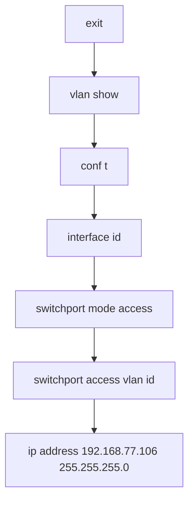
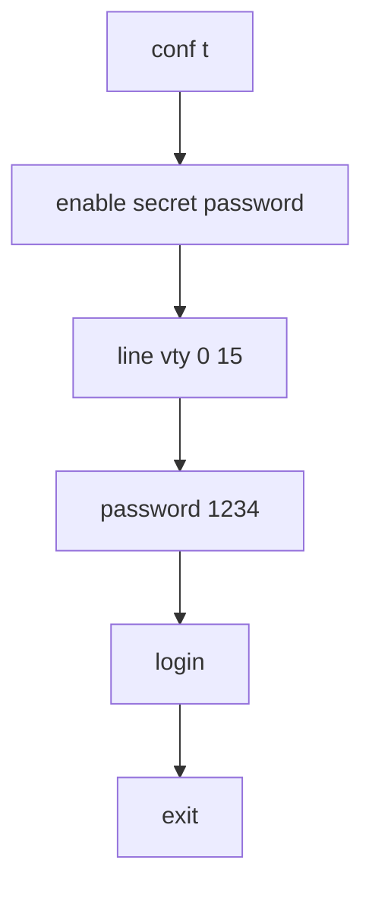

# Create vlan
### Privileged EXEC Mode
```bash
exit
```

### Privileged EXEC (#)
```bash
show vlan
```

### Global Mode 
```bash
do show vlan
```

### Configuration mode

```bash
conf t
```

### Create vlan

```bash
vlan id #10,20
```

### vlan name
```bash
name student
```

### Exit from configuration mode
```bash
exit
```

### 
```bash
Switch(config)#interface fa0/2
Switch(config-if)#
```

### access mode

```bash
switchport mode access
```


### access vlan 

```bash
Switch(config-if)#switchport access vlan 10
```




